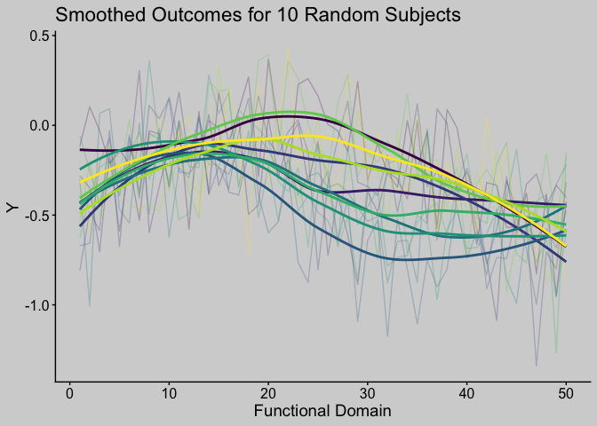

<!-- README.md is generated from README.Rmd. Please edit that file -->

# svyfosr

<!-- badges: start -->

[](https://github.com/jhuwit/svyfosr/actions/workflows/R-CMD-check.yaml)
<!-- badges: end -->

The goal of svyfosr is to perform survey-weighted function on scalar
regression.

## Installation

You can install the development version of svyfosr from
[GitHub](https://github.com/) with:

``` r
# install.packages("pak")
pak::pak("jhuwit/svyfosr")
```

## Example

We load some simulated survey data.

``` r
library(svyfosr)
library(ggplot2)
data(sample_df)

sample_df %>% 
  dplyr::glimpse()
#> Rows: 975
#> Columns: 8
#> $ id       <int> 1421, 1692, 2156, 2841, 3174, 5296, 6796, 7669, 7780, 9758, 1…
#> $ X        <dbl> 2.00743154, -1.51583313, 0.06838228, -3.68259165, -2.57527700…
#> $ strata   <int> 1, 1, 1, 1, 1, 1, 1, 1, 1, 1, 1, 1, 1, 1, 1, 1, 1, 1, 1, 1, 1…
#> $ psu      <chr> "70", "70", "70", "70", "70", "70", "70", "70", "70", "70", "…
#> $ weight   <dbl> 76.42787, 82.65374, 82.05325, 91.31247, 86.76654, 85.77362, 8…
#> $ p_stage1 <dbl> 0.02137936, 0.02137936, 0.02137936, 0.02137936, 0.02137936, 0…
#> $ p_stage2 <dbl> 0.6120031, 0.5659041, 0.5700456, 0.5122421, 0.5390799, 0.5453…
#> $ Y        <dbl[,50]> <matrix[26 x 50]>

Y_df = sample_df$Y %>% 
  tibble::as_tibble() %>% 
  dplyr::mutate(id = dplyr::row_number()) %>% 
  tidyr::pivot_longer(cols = -id) %>% 
  dplyr::mutate(l = as.numeric(sub(".*Y", "", name)))

Y_df %>% 
  dplyr::filter(id %in% 1:10) %>% 
  ggplot(aes(x = l, y = value, group = factor(id), color = factor(id))) +
  geom_line(alpha = 0.25) + 
  geom_smooth(se = FALSE) + 
  theme_classic() +
  scale_color_viridis_d(option = "D") +
  theme(legend.position = "none",
        title = element_text(size = 14)) +
  theme_sub_axis(text = element_text(size = 12),
                 title = element_text(size = 14))  +
  labs(x = "Functional Domain", y = "Y", title = "Smoothed Outcomes for 10 Random Subjects")
#> `geom_smooth()` using method = 'loess' and formula = 'y ~ x'
```

 We fit a
survey-weighted FoSR model using balanced repeated replication (BRR) to
estimate standard errors.

``` r
model_fit = svyfosr::svyfui(Y ~ X,
                            data = sample_df, 
                            weights = weight,
                            family = gaussian(),
                            boot_type = "BRR",
                            num_boots = 100,
                            parallel = TRUE,
                            n_cores = 6, 
                            seed = 2213)

plot(model_fit)
```


